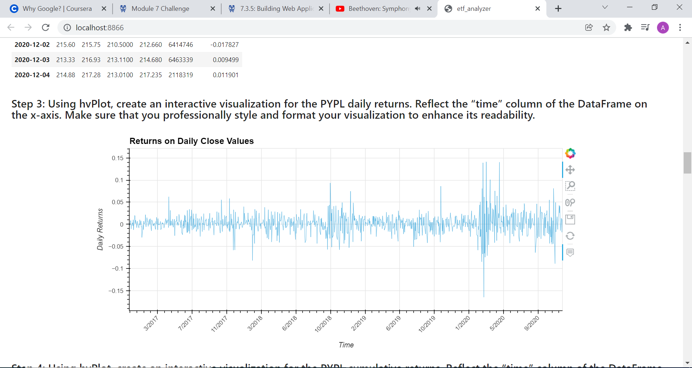
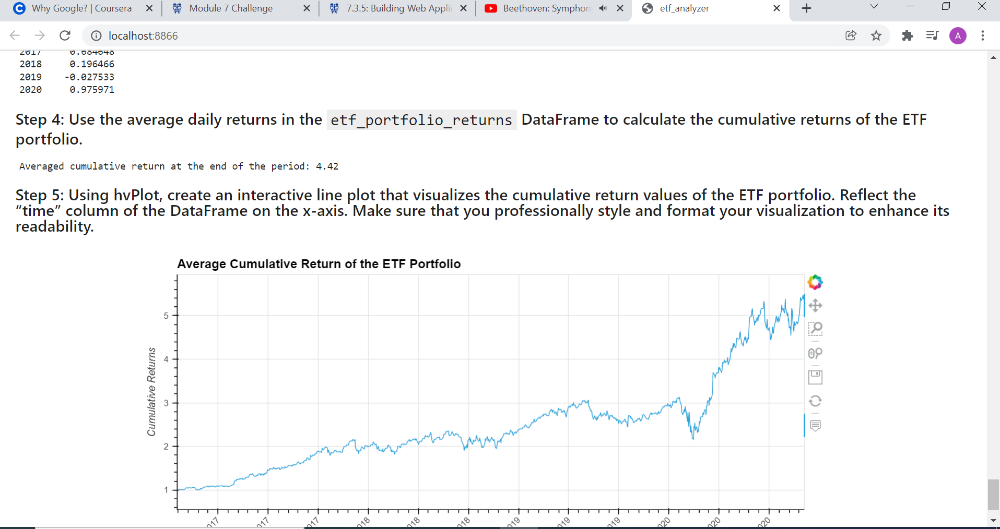

# Challenge7

## Analyze a Single Asset in the ETF

By means of the query and the pandas function `read_sql_query` it is possible to create a dataframe from the relevant table contained in the database, which is PYPL in this case.
The dataframe has already a column with the daily returns, from which it is possible to plot the graph, and by taking the cumulative product plotting the cumulative returns.

## Optimize Data Access with Advanced SQL Queries

Here we make two different queries:

1- the first one selects time and close value from the PYPL table where the price is greater than 200 dollars.
2- the second one selects the 10 best daily returns, by ordering them in descending order and taking the first 10

## Analyze the ETF Portfolio

In this last part we want to access to all the different tables, making a join operation based on the common time column's values. In doing that we don't select all the columns, since the time column would be repeated multiple times.
To improve readability of the DataFrame we create a list of tuples, in order to create later the a multindex object. In this way we know for which stock the columns are relevant to.
We compute the average daily returns; for the scope we imply that each stock equally makes up 25% of the total portfolio's asset.
We can then compute for each year the annualized return. After this,
we set the time as index, so the information remains untouched while manipulating the data.
We can then compute the cumulative returns and plot them.

Afer all this passages we can create a Voila application by typing in the Bash `voila <path_to_notebook>`.

